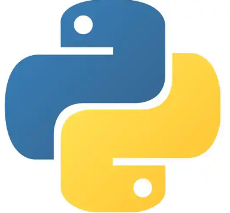

<!-- 

    
    
    
    
    

 -->

  <!-- 1. NoiseKWS 项目卡片 -->
  <a href="https://github.com/beta-nlp/NoiseKWS" class="project-card" target="_blank">
    <!-- 卡片头部：GitHub图标 + 仓库名 -->
    

      
      <h3 class="repo-name">beta-nlp / NoiseKWS</h3>
    

    <!-- 卡片描述 -->
    
The dataset and codes of NoiseKWS.

    <!-- 卡片底部：语言 + 星标 -->
    

      
        <!-- 若有Python图标则用img，无则直接写文字 -->
        
        Python
      
      ★ 1 <!-- 手动填写实际星标数量 -->
    

  </a>

  <!-- 2. MDRanker 项目卡片 -->
  <a href="https://github.com/beta-nlp/MDRanker" class="project-card" target="_blank">
    

      
      <h3 class="repo-name">beta-nlp / MDRanker</h3>
    

    
No description provided.
 <!-- 按实际描述填写 -->
    

      
        
        Python
      
      ★ 0 <!-- 手动填写实际星标数量 -->
    

  </a>

  <!-- 3. GAR 项目卡片 -->
  <a href="https://github.com/beta-nlp/GAR" class="project-card" target="_blank">
    

      
      <h3 class="repo-name">beta-nlp / GAR</h3>
    

    
Code for paper "Ranking Augmented Generation: Leveraging Diversity for Better Text Generation"

    

      
        
        Python
      
      ★ 5 <!-- 手动填写实际星标数量 -->
    

  </a>

  <!-- 4. CICD 项目卡片 -->
  <a href="https://github.com/beta-nlp/CICD" class="project-card" target="_blank">
    

      
      <h3 class="repo-name">beta-nlp / CICD</h3>
    

    
No description provided.

    

      
        
        Python
      
      ★ 2 <!-- 手动填写实际星标数量 -->
    

  </a>

  <!-- 5. RAAMove 项目卡片 -->
  <a href="https://github.com/ljk1228/RAAMove" class="project-card" target="_blank">
    

      
      <h3 class="repo-name">ljk1228 / RAAMove</h3>
    

    
No description provided.

    

      
        
        Python
      
      ★ 1 <!-- 手动填写实际星标数量 -->
    

  </a>

