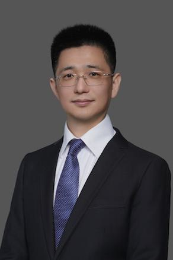

### 教师

<!-- Faculty卡片容器：控制多个卡片的布局 -->

  <!-- 第一位Faculty：Chong Feng -->
  <a href="https://cs.bit.edu.cn/szdw/jsml/bssds/d19aacaa824841fa8ea60a9a665d9625.htm" class="faculty-link">
  

    <!-- 头像 -->
    
    <!-- 下方简介：参考image格式，包含姓名、时间、身份、研究方向、荣誉 -->
    

      <h4 class="faculty-name">冯冲</h4>
      
教授, 博士生导师

      <!-- 
Research Focus: [研究方向，如Large Language Models, Knowledge Graphs]

      
[相关荣誉，如XX Project PI, ACL Senior Program Committee]
 -->
    

  

  </a>

   

    <!-- 头像 -->
    
    <!-- 下方简介：参考image格式，包含姓名、时间、身份、研究方向、荣誉 -->
    

      <h4 class="faculty-name">石戈</h4>
      
副教授, 博士生导师

      <!-- 
Research Focus: [研究方向，如Large Language Models, Knowledge Graphs]

      
[相关荣誉，如XX Project PI, ACL Senior Program Committee]
 -->
    

  

  <a href="https://cs.bit.edu.cn/szdw/jsml/sssds/46c68d5f9f064fc6bd6b510a62f7c189.htm" class="faculty-link">
  

    <!-- 头像 -->
    
    <!-- 下方简介 -->
    

      <h4 class="faculty-name">郭宇航</h4>
      
讲师, 硕士生导师

      <!-- 
Research Focus: [研究方向]

      
[相关荣誉]
 -->
    

  

</a>

  

    <!-- 头像 -->
    
    <!-- 下方简介：参考image格式，包含姓名、时间、身份、研究方向、荣誉 -->
    

      <h4 class="faculty-name">周杰</h4>
      
博士后

      <!-- 
Research Focus: [研究方向，如Large Language Models, Knowledge Graphs]

      
[相关荣誉，如XX Project PI, ACL Senior Program Committee]
 -->
    

  

### 博士

赵培雯, 赵轩, 孟凡擎, 王博, 赵建飞, 黄双宏, 张晔鹏, 彭一平, 付旭松
, 盛尧, 曾理, 王珩琨，哈哥斯

### 硕士
朱函琪, 徐豪杰, 高宇龙, 程光, 张开元, 陈嘉伟, 王守臻, 王启雯, 高铭泽, 林翔, 闫文柏, 韩芳暖

